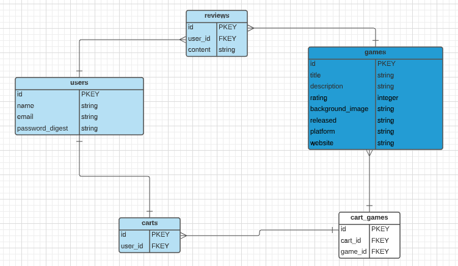
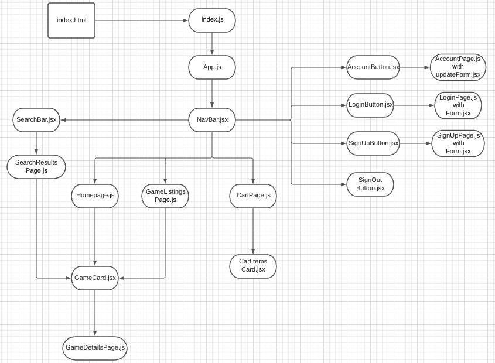

# GameStart

## Date: 9/17/2021

### By:

### Raza Khalid

[GitHub](https://github.com/Raza-Khalid?tab=repositories) | [LinkedIn](https://www.linkedin.com/feed/)

### Sam Bassong

[GitHub](https://github.com/sbassong) | [LinkedIn](https://www.linkedin.com/in/sambassong/)

### Jin Im Brancalhao

[GitHub](https://github.com/jinimbrancalhao) | [LinkedIn](https://www.linkedin.com/in/jin-im-826a6b215/)

---

**_Description_**

GameStart is an e-commerce application in which users can browse, learn about, and add various games to their cart.

**_Technologies Used_**

- PostgreSQL
- Express.js
- React
- Node.js
- Sequelize
- Heroku

**_Getting Started_**

**_Screenshots_**

Entity Relationship Diagram

Component Hierarchy Diagram

**_Future Updates_**

**_Credits_**
