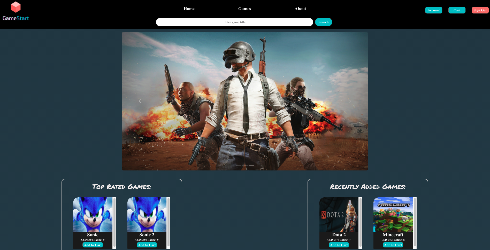
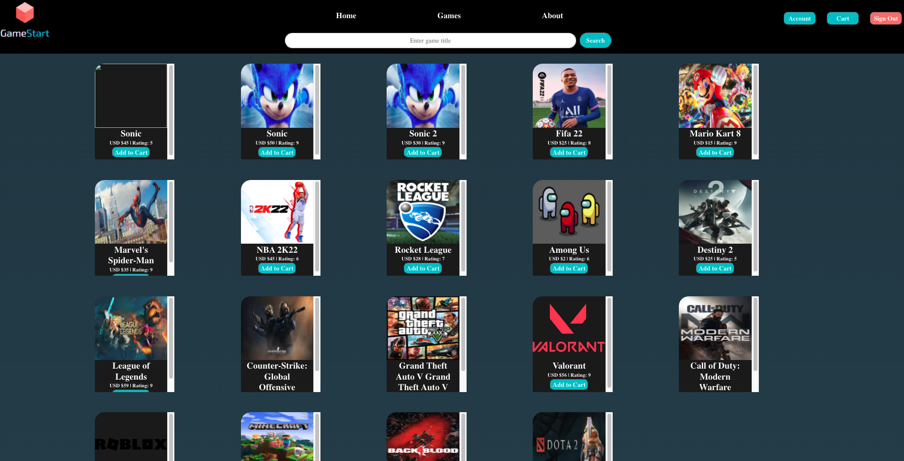
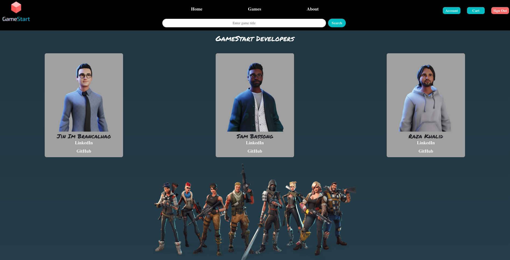

# 

## **_Developers_**

### Sam Bassong

[Portfolio](https://www.sambassong.com/) | [LinkedIn](https://www.linkedin.com/in/sambassong/) | [GitHub](https://github.com/sbassong)

### Jin Im Brancalhao

[Portfolio]() [LinkedIn](https://www.linkedin.com/in/jinimb/) | [GitHub](https://github.com/jinimbrancalhao) 

### Raza Khalid

[Portfolio](https://developer-folio-ooxykuuww-saadpasta.vercel.app/) | [LinkedIn](https://www.linkedin.com/in/razaskhalid/) | [GitHub](https://github.com/Raza-Khalid?tab=repositories)

#### Date: 9/17/2021
---

**_Description_**

GameStart is an e-commerce, fully functional, intuitive, engaging full-stack application in which users can browse games, learn about their new games, sell/trade their game inventory, and add various games to their cart. This web application leverages the PERN stack (PostGres, Express, React, Node), Sequelize, Bootstrap, and will be deployed on Heroku. This project was designed and implemented by Jin Im Brancalhao, Raza Khalid, and Sam Bassong for their project 3 @ General Assembly Immersive.

---

**_Tech Stack_**

- [PostgreSQL](https://www.postgresql.org/) - object-relational database
- [Express.js](https://expressjs.com/) - web framework for Node.js
- [React](https://reactjs.org/) - (Best) Frontend JS library
- [Node.js](https://nodejs.org/en/) - JS runtime
- [Sequelize](https://sequelize.org/master/) - Postgres ORM
- [Heroku](https://www.heroku.com/home) - Deployment host
- [Bootstrap](https://getbootstrap.com/) - Styled components library
- [SweetAlert](https://sweetalert.js.org/) - beautiful replacement for JS's alert system

---

**_Getting Started_**

- Please create an account for full functionality
- The App is intuitive and engaging so have fun!

* ### [Application](https://peaceful-everglades-79165.herokuapp.com/)
* ### [Trello](https://trello.com/b/Ei33KKs1/gamestart)

---

**_Screenshots_**

Home Page

Games Page

About Page

---

**_Future Updates_**

- [x] Integrate a UI Library
- [ ] Add checkout functionality
- [ ] Free delivery functionality
- [ ] Users can sell/trade games
- [ ] Filter by Sidebar

---

**_Credits_**

#### Support and Help: SEI-DRY @ GA

#### Inspiration: GameStop

#### Sound effects: [Mixkit](https://mixkit.co/)

#### Pictures: [Google Images](https://google.com)

#### Logo: [Canva](http://canva.com)

#### Fonts: [Google Fonts](https://fonts.google.com/)
